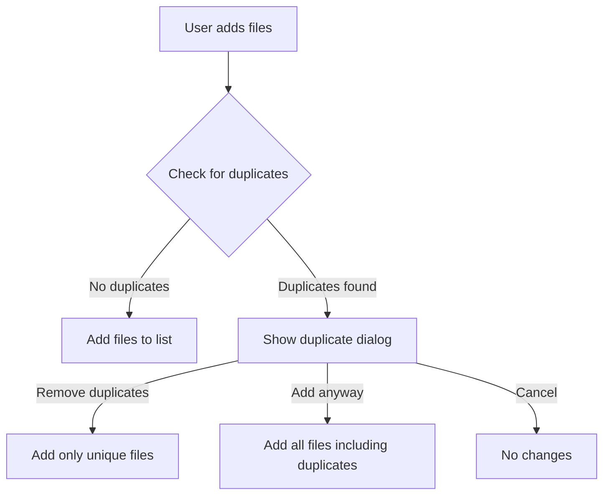

# Duplicate Detection Before Sending - Implementation Plan

## Overview

This plan outlines the implementation of duplicate file detection within the selected files list before sending. The goal is to prevent users from accidentally adding the same file multiple times to a single transfer.

## Current State Analysis

### File Selection Flow

Files are added to the transfer list through multiple entry points in [`FilePickerScreen`](lib/ui/screens/file_picker_screen.dart):

1. **Drag & Drop** - [`_handleDroppedFiles()`](lib/ui/screens/file_picker_screen.dart:100)
2. **File Picker** - [`_pickFiles()`](lib/ui/screens/file_picker_screen.dart:179)
3. **Media Picker** - [`_pickMedia()`](lib/ui/screens/file_picker_screen.dart:213)
4. **Folder Picker** - [`_pickFolder()`](lib/ui/screens/file_picker_screen.dart:248)
5. **Preselected Files** - From `widget.preselectedFiles` in [`initState()`](lib/ui/screens/file_picker_screen.dart:59)

### TransferItem Model

The [`TransferItem`](lib/core/models/transfer.dart:193) class contains:
- `name` - File name
- `path` - Full file path (unique identifier)
- `size` - File size in bytes
- `isDirectory` - Whether it's a directory

### Existing Services

- [`StreamingHashService`](lib/core/services/streaming_hash_service.dart) - SHA-256 hash calculation with streaming support

## Proposed Solution

### 1. Create DuplicateDetectionService

A new service to detect duplicates using multiple strategies:

```dart
// lib/core/services/duplicate_detection_service.dart

/// Result of duplicate detection
class DuplicateDetectionResult {
  final List<TransferItem> uniqueItems;
  final Map<TransferItem, TransferItem> duplicates; // duplicate -> original mapping
  final bool hasDuplicates;
}

/// Detection strategy
enum DuplicateDetectionStrategy {
  pathOnly,      // Fast: Compare file paths
  pathAndSize,   // Medium: Path + size comparison
  contentHash,   // Slow: SHA-256 hash comparison
}

class DuplicateDetectionService {
  /// Detect duplicates in a list of items against existing items
  Future<DuplicateDetectionResult> detectDuplicates({
    required List<TransferItem> newItems,
    required List<TransferItem> existingItems,
    DuplicateDetectionStrategy strategy = DuplicateDetectionStrategy.pathOnly,
  });
}
```

### 2. Detection Strategies

#### Strategy 1: Path Only (Default - Fast)
- Compare file paths directly
- Case-insensitive on Windows, case-sensitive on Unix
- O(n) complexity

#### Strategy 2: Path and Size
- Compare paths first
- If paths differ but sizes match, flag for review
- Useful for detecting renamed duplicates

#### Strategy 3: Content Hash (Optional)
- Use existing [`StreamingHashService`](lib/core/services/streaming_hash_service.dart)
- Calculate SHA-256 hash for files with same size
- Memory-efficient streaming approach
- Only used when explicitly enabled or for files under a size threshold

### 3. UI Integration

#### Duplicate Detection Dialog

When duplicates are detected, show a dialog with options:

```
┌─────────────────────────────────────────────────┐
│  Duplicate Files Detected                  [X]  │
├─────────────────────────────────────────────────┤
│                                                 │
│  The following files are already in the list:  │
│                                                 │
│  📄 photo.jpg                                   │
│     Already added from: /path/to/photo.jpg      │
│     [Remove Duplicate]                          │
│                                                 │
│  📄 document.pdf                                │
│     Already added from: /path/to/document.pdf   │
│     [Remove Duplicate]                          │
│                                                 │
│  [Remove All Duplicates]  [Add Anyway]          │
└─────────────────────────────────────────────────┘
```

### 4. Implementation Flow



## Files to Create/Modify

### New Files

1. **`lib/core/services/duplicate_detection_service.dart`**
   - Duplicate detection logic
   - Multiple detection strategies
   - Result model classes

2. **`lib/ui/widgets/duplicate_files_dialog.dart`**
   - Dialog widget for showing duplicates
   - User action handling

3. **`test/services/duplicate_detection_service_test.dart`**
   - Unit tests for detection service

### Modified Files

1. **`lib/ui/screens/file_picker_screen.dart`**
   - Integrate duplicate detection in all file selection methods
   - Show duplicate dialog when needed

2. **`lib/core/providers/transfer_provider.dart`** (optional)
   - Add provider for DuplicateDetectionService if using Riverpod

## Detailed Implementation Steps

### Step 1: Create DuplicateDetectionService

Create the service with:
- Path-based duplicate detection (immediate)
- Size-based duplicate flagging (immediate)
- Hash-based duplicate detection (async, optional)

### Step 2: Create Duplicate Files Dialog

Create a reusable dialog widget that:
- Lists all detected duplicates
- Shows the original file path for each duplicate
- Provides options to remove duplicates or add anyway

### Step 3: Integrate into FilePickerScreen

Modify each file selection method:
1. After getting new files, call duplicate detection
2. If duplicates found, show dialog
3. Based on user choice, add appropriate files

### Step 4: Add Unit Tests

Test cases:
- No duplicates scenario
- Exact path duplicates
- Same content, different path (hash-based)
- Mixed scenario with some duplicates

## Configuration Options

Consider adding settings for:
- Enable/disable duplicate detection
- Default detection strategy
- Maximum file size for hash-based detection
- Show notification vs. dialog preference

## Performance Considerations

1. **Path-based detection**: Instant, no performance impact
2. **Size-based detection**: Instant, minimal overhead
3. **Hash-based detection**: 
   - Use streaming to avoid memory issues
   - Consider file size threshold (e.g., only hash files < 100MB)
   - Show progress indicator for large files
   - Can be done in background with cancellation support

## Error Handling

- Handle file access errors during hash calculation
- Handle cancellation during hash computation
- Graceful fallback to path-only detection if hash fails

## Future Enhancements

1. **Persistent hash cache**: Store computed hashes to avoid recomputation
2. **Transfer history check**: Warn about files recently sent
3. **Smart suggestions**: Suggest removing older versions of same file
