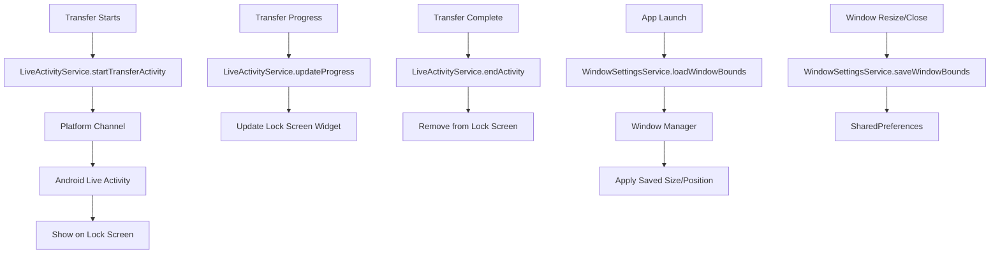

# Implementation Plan: Android Live Activity & Window Size Persistence

## Feature 1: Android Live Activity for Transfer Progress

### Overview
Display real-time transfer progress on the Android lock screen using Android's Live Activity API.

### Implementation Steps

#### 1.1 Add Dependencies (pubspec.yaml)
```yaml
dependencies:
  flutter_activity_recovery: ^1.0.0  # For cross-platform activity recovery
```

#### 1.2 Create Live Activity Service (lib/core/services/live_activity_service.dart)
- Create `LiveActivityService` class
- Methods:
  - `startTransferActivity(String fileName, int totalBytes)` - Start new activity
  - `updateProgress(int bytesTransferred, double speed)` - Update progress
  - `endActivity(bool success)` - Complete/fail activity
- Use platform channels to communicate with native Android code

#### 1.3 Create Android Native Live Activity
**File: android/app/src/main/kotlin/.../LiveActivityService.kt**
- Extend `FlutterPlugin` for platform channel
- Implement `ActivityKit` for Live Activities
- Create `TransferActivityWidget` for lock screen display

**File: android/app/src/main/res/layout/transfer_activity.xml**
- Layout for lock screen widget showing:
  - File name
  - Progress bar
  - Percentage
  - Transfer speed
  - Cancel button

#### 1.4 Register in AndroidManifest.xml
- Add `android:enableOnBackInvokedCallback="true"`
- Register Live Activity permission

#### 1.5 Integrate with Transfer Service
- Update `transfer_service_impl.dart` to call `LiveActivityService`
- Start activity when transfer begins
- Update progress during transfer
- End activity on completion/failure

---

## Feature 2: Window Size Persistence

### Overview
Remember and restore window size and position for Desktop platforms (Windows/Linux/macOS).

### Implementation Steps

#### 2.1 Add Dependencies (pubspec.yaml)
```yaml
dependencies:
  window_manager: ^0.4.0  # For desktop window management
  shared_preferences: ^2.3.0  # For persisting settings
```

#### 2.2 Create Window Settings Service (lib/core/services/window_settings_service.dart)
```dart
class WindowSettingsService {
  static const String _keyWindowWidth = 'window_width';
  static const String _keyWindowHeight = 'window_height';
  static const String _keyWindowX = 'window_x';
  static const String _keyWindowY = 'window_y';
  static const String _keyWindowMaximized = 'window_maximized';
  
  // Save window bounds
  static Future<void> saveWindowBounds(Size size, Offset position, bool maximized);
  
  // Load saved window bounds
  static Future<WindowBounds?> loadWindowBounds();
  
  // Clear saved settings
  static Future<void> clearSettings();
}
```

#### 2.3 Update main.dart
- Import `window_manager`
- Initialize window manager in `main()`
- Load saved window settings before showing app
- Listen for window events to save settings

#### 2.4 Modify Desktop Window Creation
- Update platform-specific window setup in:
  - `linux/my_application.cc`
  - `windows/runner/main.cpp`
  - macOS in `macos/Runner/AppDelegate.swift`

---

## File Changes Summary

### New Files to Create
1. `lib/core/services/live_activity_service.dart` - Live Activity API service
2. `lib/core/services/window_settings_service.dart` - Window persistence service

### Files to Modify
1. `pubspec.yaml` - Add dependencies
2. `lib/main.dart` - Initialize window manager
3. `lib/core/services/transfer_service/transfer_service_impl.dart` - Integrate Live Activity
4. `android/app/build.gradle` - Enable activity features
5. `android/app/src/main/AndroidManifest.xml` - Add permissions
6. `android/app/src/main/kotlin/.../LiveActivityService.kt` - Native implementation

---

## Mermaid Diagram: Architecture



---

## Testing Checklist

### Android Live Activity
- [ ] Start transfer shows Live Activity on lock screen
- [ ] Progress updates reflect actual transfer progress
- [ ] Live Activity shows file name, progress %, speed
- [ ] Cancel button works
- [ ] Activity removed on completion/failure

### Window Size Persistence
- [ ] Window size saved on close
- [ ] Window position saved on close
- [ ] Maximized state saved
- [ ] Settings restored on app launch
- [ ] Works on Windows, Linux, macOS
