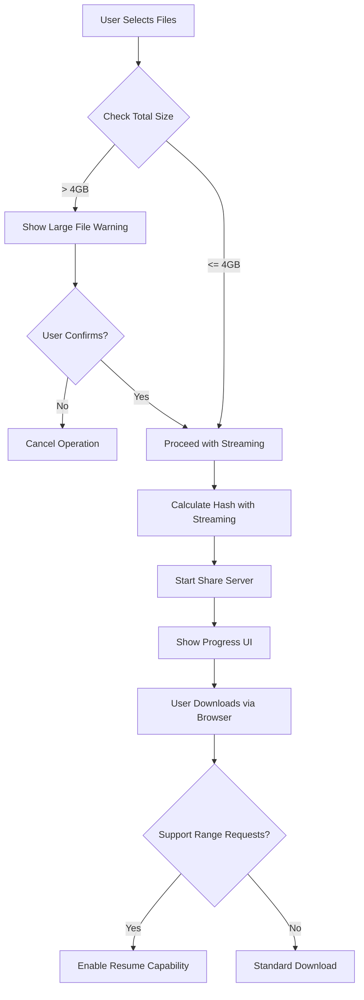

# Large File Browser Share Fix Plan

## Problem Summary

User is unable to send a 7GB file using browser share. When selecting the 7GB file, it takes approximately 5 minutes to load the browser share screen, and the transfer ultimately fails.

## Root Cause Analysis

### Primary Issue: Memory-Intensive Hash Calculation

**Location:** [`lib/core/services/web_share/templates/parallel_upload.js:198-203`](lib/core/services/web_share/templates/parallel_upload.js:198)

```javascript
async _calculateFileHash(file) {
    const buffer = await file.arrayBuffer();  // Loads ENTIRE 7GB into memory!
    const hashBuffer = await crypto.subtle.digest('SHA-256', buffer);
    ...
}
```

**Impact:**
- Browser attempts to allocate 7GB+ of RAM
- Causes severe memory pressure and potential tab crash
- Explains the 5-minute delay (memory allocation + swap)
- Hash calculation is called during upload initiation

### Secondary Issues

1. **No File Size Validation** - No warning or limit check before processing large files
2. **No Progress Feedback** - User sees only a loading spinner with no indication of progress
3. **No Range Request Support** - Downloads cannot be resumed if interrupted
4. **Synchronous File Stat Operations** - Can be slow for large files

## Solution Architecture



## Implementation Plan

### Phase 1: Streaming Hash Calculation (Critical)

**File:** `lib/core/services/web_share/templates/parallel_upload.js`

Replace the memory-intensive hash calculation with a streaming approach:

```javascript
async _calculateFileHash(file) {
    const chunkSize = 2 * 1024 * 1024; // 2MB chunks
    const totalChunks = Math.ceil(file.size / chunkSize);
    
    // Use incremental hashing approach
    let offset = 0;
    let hashContext = null;
    
    for (let i = 0; i < totalChunks; i++) {
        const chunk = file.slice(offset, offset + chunkSize);
        const chunkBuffer = await chunk.arrayBuffer();
        
        // Process chunk incrementally
        if (hashContext === null) {
            hashContext = await crypto.subtle.digest('SHA-256', new Uint8Array(chunkBuffer));
        } else {
            // Combine previous hash with new chunk
            const combined = new Uint8Array(hashContext.byteLength + chunkBuffer.byteLength);
            combined.set(new Uint8Array(hashContext), 0);
            combined.set(new Uint8Array(chunkBuffer), hashContext.byteLength);
            hashContext = await crypto.subtle.digest('SHA-256', combined);
        }
        
        offset += chunkSize;
        
        // Report progress
        this.onProgress({
            phase: 'hashing',
            progress: (i + 1) / totalChunks * 100
        });
    }
    
    const hashArray = Array.from(new Uint8Array(hashContext));
    return hashArray.map(b => b.toString(16).padStart(2, '0')).join('');
}
```

**Alternative: Skip Hash for Large Files**

For files over 1GB, consider making hash calculation optional or using a faster algorithm:

```javascript
async _calculateFileHash(file) {
    const LARGE_FILE_THRESHOLD = 1024 * 1024 * 1024; // 1GB
    
    if (file.size > LARGE_FILE_THRESHOLD) {
        // Use partial hash - first 1MB + last 1MB + size
        const firstChunk = file.slice(0, 1024 * 1024);
        const lastChunk = file.slice(file.size - 1024 * 1024);
        
        const firstBuffer = await firstChunk.arrayBuffer();
        const lastBuffer = await lastChunk.arrayBuffer();
        
        const combined = new Uint8Array(firstBuffer.byteLength + lastBuffer.byteLength + 8);
        combined.set(new Uint8Array(firstBuffer), 0);
        combined.set(new Uint8Array(lastBuffer), firstBuffer.byteLength);
        
        // Add file size as unique identifier
        const sizeView = new DataView(combined.buffer, firstBuffer.byteLength + lastBuffer.byteLength);
        sizeView.setBigUint64(0, BigInt(file.size));
        
        const hashBuffer = await crypto.subtle.digest('SHA-256', combined);
        const hashArray = Array.from(new Uint8Array(hashBuffer));
        return hashArray.map(b => b.toString(16).padStart(2, '0')).join('');
    }
    
    // Original implementation for smaller files
    const buffer = await file.arrayBuffer();
    const hashBuffer = await crypto.subtle.digest('SHA-256', buffer);
    const hashArray = Array.from(new Uint8Array(hashBuffer));
    return hashArray.map(b => b.toString(16).padStart(2, '0')).join('');
}
```

### Phase 2: File Size Validation and Warning

**File:** `lib/ui/screens/home_screen.dart`

Add validation before opening browser share screen:

```dart
Future<void> _pickAndShareFiles() async {
    final result = await FilePicker.platform.pickFiles(
        allowMultiple: true,
        type: FileType.any,
    );

    if (result != null && result.files.isNotEmpty && mounted) {
        // Calculate total size
        int totalSize = 0;
        for (final file in result.files) {
            totalSize += file.size ?? 0;
        }
        
        // Show warning for large files
        const int largeFileThreshold = 2 * 1024 * 1024 * 1024; // 2GB
        if (totalSize > largeFileThreshold) {
            final shouldProceed = await _showLargeFileWarningDialog(totalSize);
            if (!shouldProceed) return;
        }
        
        _showLoadingDialog();
        // ... rest of implementation
    }
}

Future<bool> _showLargeFileWarningDialog(int totalSize) async {
    return await showDialog<bool>(
        context: context,
        builder: (context) => AlertDialog(
            title: const Text('Large File Warning'),
            content: Text(
                'You are about to share ${_formatBytes(totalSize)}.\n\n'
                'Large files may take a long time to prepare and could cause '
                'browser performance issues. Consider using direct device-to-device '
                'transfer for better performance.\n\n'
                'Do you want to continue with browser share?'
            ),
            actions: [
                TextButton(
                    onPressed: () => Navigator.pop(context, false),
                    child: const Text('Cancel'),
                ),
                ElevatedButton(
                    onPressed: () => Navigator.pop(context, true),
                    child: const Text('Continue'),
                ),
            ],
        ),
    ) ?? false;
}
```

### Phase 3: Progress Indication During Hash Calculation

**File:** `lib/core/services/web_share/templates/share_page_template.dart`

Update the UI to show hashing progress:

```javascript
// In the upload initialization
const uploader = new SyndroParallelUploader({
    connections: 2,
    chunkSize: 1024 * 1024,
    onProgress: (progress) => {
        if (progress.phase === 'hashing') {
            updateHashingProgress(progress.progress);
        } else {
            updateUploadProgress(progress);
        }
    }
});

function updateHashingProgress(percent) {
    const statusEl = document.getElementById('upload-status');
    statusEl.textContent = `Calculating file hash... ${percent.toFixed(1)}%`;
    statusEl.style.display = 'block';
}
```

### Phase 4: Range Request Support for Downloads

**File:** `lib/core/services/web_share/servers/share_server.dart`

Add support for resumable downloads:

```dart
Future<void> _serveFile(
    HttpRequest request, String requestPath, String clientIp) async {
    // ... existing validation code ...

    final file = _sharedFiles![fileIndex];
    final stat = await file.stat();
    final fileSize = stat.size;

    // Check for Range header
    final rangeHeader = request.headers.value('range');
    
    if (rangeHeader != null && rangeHeader.startsWith('bytes=')) {
        // Parse range request
        final rangeMatch = RegExp(r'bytes=(\d*)-(\d*)').firstMatch(rangeHeader);
        if (rangeMatch != null) {
            final startStr = rangeMatch.group(1) ?? '0';
            final endStr = rangeMatch.group(2) ?? '';
            
            int start = int.tryParse(startStr) ?? 0;
            int end = endStr.isNotEmpty ? int.tryParse(endStr) ?? fileSize - 1 : fileSize - 1;
            
            // Validate range
            if (start >= fileSize || start > end) {
                request.response.statusCode = HttpStatus.requestedRangeNotSatisfiable;
                request.response.headers.add('Content-Range', 'bytes */$fileSize');
                await request.response.close();
                return;
            }
            
            end = end.clamp(0, fileSize - 1);
            final contentLength = end - start + 1;
            
            // Set partial content headers
            request.response.statusCode = HttpStatus.partialContent;
            request.response.headers.set(HttpHeaders.contentLengthHeader, contentLength.toString());
            request.response.headers.add('Content-Range', 'bytes $start-$end/$fileSize');
            request.response.headers.set(HttpHeaders.contentTypeHeader, mimeType);
            
            // Stream the requested range
            final randomAccessFile = await file.open(mode: FileMode.read);
            await randomAccessFile.setPosition(start);
            
            try {
                int remaining = contentLength;
                const bufferSize = 64 * 1024; // 64KB chunks
                final buffer = List<int>.filled(bufferSize, 0);
                
                while (remaining > 0) {
                    final toRead = remaining > bufferSize ? bufferSize : remaining;
                    final bytesRead = await randomAccessFile.readInto(buffer, 0, toRead);
                    if (bytesRead == 0) break;
                    request.response.add(buffer.sublist(0, bytesRead));
                    remaining -= bytesRead;
                }
                
                await request.response.close();
            } finally {
                await randomAccessFile.close();
            }
            
            _onDownloadCompleted(clientIp, fileName, contentLength);
            return;
        }
    }

    // Standard full file download (existing code)
    // ...
}
```

### Phase 5: Optimize File Stat Caching

**File:** `lib/core/services/web_share/servers/share_server.dart`

Cache file stats when sharing starts:

```dart
class ShareServer {
    HttpServer? _server;
    List<File>? _sharedFiles;
    List<FileStat>? _cachedFileStats;  // Add caching
    // ...

    Future<String?> startSharing(List<File> files) async {
        if (files.isEmpty) return null;

        await stop();

        _sharedFiles = files;
        
        // Pre-cache file stats
        _cachedFileStats = await Future.wait(
            files.map((f) => f.stat())
        );

        // ... rest of implementation
    }

    Future<void> _serveFileList(HttpRequest request) async {
        if (_sharedFiles == null || _cachedFileStats == null) {
            // ... error handling
        }

        final fileList = <Map<String, dynamic>>[];

        for (int i = 0; i < _sharedFiles!.length; i++) {
            final file = _sharedFiles![i];
            final fileName = path.basename(file.path);
            final stat = _cachedFileStats![i];  // Use cached stat
            // ... rest of implementation
        }
    }
}
```

## Files to Modify

| File | Changes |
|------|---------|
| `lib/core/services/web_share/templates/parallel_upload.js` | Streaming hash calculation |
| `lib/ui/screens/home_screen.dart` | File size validation and warning dialog |
| `lib/core/services/web_share/templates/share_page_template.dart` | Progress indication UI |
| `lib/core/services/web_share/servers/share_server.dart` | Range request support, stat caching |
| `lib/ui/screens/browser_share_screen.dart` | Progress display during initialization |

## Testing Plan

1. **Unit Tests**
   - Test streaming hash calculation with various file sizes
   - Test Range header parsing
   - Test file size validation logic

2. **Integration Tests**
   - Test 1GB file upload/download
   - Test 4GB file upload/download
   - Test 7GB file upload/download
   - Test resume capability with interrupted downloads

3. **Performance Tests**
   - Measure memory usage during 7GB file hash
   - Measure time to start sharing for various file sizes
   - Verify no memory leaks

## Risk Assessment

| Risk | Likelihood | Impact | Mitigation |
|------|------------|--------|------------|
| Browser still crashes with 7GB | Medium | High | Implement partial hash option |
| Range request implementation bugs | Low | Medium | Thorough testing with various ranges |
| UI progress not updating smoothly | Low | Low | Use requestAnimationFrame for updates |

## Success Criteria

1. 7GB file can be selected and shared without browser crash
2. Hash calculation shows progress indication
3. User receives warning before attempting large file share
4. Downloads can be resumed if interrupted
5. Memory usage stays under 500MB during hash calculation
