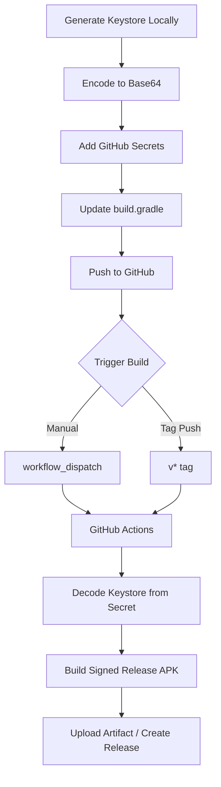

# Release Signing Setup Guide

This guide explains how to set up proper release signing for Android APK builds using GitHub Secrets.

## Overview

The GitHub Actions workflow (`.github/workflows/build-android.yml`) already supports release signing, but needs:
1. A keystore file
2. GitHub Secrets configured
3. `build.gradle` updated to use environment-based signing

## One-Time Setup: Generate Keystore

Run this command on your local machine (any machine with Java installed):

```bash
keytool -genkey -v -keystore syndro-release.jks -keyalg RSA -keysize 2048 -validity 10000 -alias syndro
```

You will be prompted for:
- Keystore password (keep this safe!)
- Key password (can be same as keystore password)
- Your name, organization, etc.

**Important:** Backup the `syndro-release.jks` file securely. If lost, you cannot update your app on Play Store!

## Encode Keystore as Base64

### Linux/macOS:
```bash
base64 -i syndro-release.jks | pbcopy  # macOS (copies to clipboard)
base64 -w 0 syndro-release.jks         # Linux
```

### Windows (PowerShell):
```powershell
[Convert]::ToBase64String([IO.File]::ReadAllBytes("syndro-release.jks")) | Set-Clipboard
```

## Configure GitHub Secrets

Go to your GitHub repository → Settings → Secrets and variables → Actions → New repository secret

Add these 4 secrets:

| Secret Name | Value |
|-------------|-------|
| `KEYSTORE_BASE64` | The base64-encoded keystore string from previous step |
| `KEYSTORE_PASSWORD` | The password you set for the keystore |
| `KEY_ALIAS` | `syndro` (or whatever alias you used) |
| `KEY_PASSWORD` | The key password (usually same as keystore password) |

## Required Code Changes

### Update `android/app/build.gradle`

The build.gradle needs to be updated to use environment-based signing configuration:

```gradle
android {
    // ... existing config ...

    signingConfigs {
        release {
            // Read from environment variables (for CI/CD)
            // Fallback to debug for local builds
            if (System.getenv("KEYSTORE_BASE64") != null) {
                // CI/CD environment - use decoded keystore
                storeFile file("keystore.jks")
                storePassword System.getenv("KEYSTORE_PASSWORD")
                keyAlias System.getenv("KEY_ALIAS")
                keyPassword System.getenv("KEY_PASSWORD")
            } else if (file("keystore.jks").exists()) {
                // Local environment with keystore file
                storeFile file("keystore.jks")
                storePassword System.getenv("KEYSTORE_PASSWORD") ?: "your-debug-password"
                keyAlias System.getenv("KEY_ALIAS") ?: "syndro"
                keyPassword System.getenv("KEY_PASSWORD") ?: System.getenv("KEYSTORE_PASSWORD") ?: "your-debug-password"
            }
        }
    }

    buildTypes {
        release {
            signingConfig signingConfigs.release
            minifyEnabled true
            shrinkResources true
            proguardFiles getDefaultProguardFile('proguard-android-optimize.txt'), 'proguard-rules.pro'
        }
    }
}
```

### Note about proguard-rules.pro

If you enable minification (`minifyEnabled true`), create `android/app/proguard-rules.pro`:

```proguard
# Flutter
-keep class io.flutter.** { *; }
-keep class io.flutter.plugins.** { *; }

# Keep native methods
-keepclasseswithmembernames class * {
    native <methods>;
}
```

## Workflow Diagram



## Verification

After setup, trigger a release build:
1. Go to Actions → Build Android APK
2. Click "Run workflow"
3. Select "release"
4. Run workflow

The resulting APK will be properly signed with your release key.

## Local Builds

For local release builds, place `keystore.jks` in `android/app/` and set environment variables:

```bash
export KEYSTORE_PASSWORD="your-password"
export KEY_ALIAS="syndro"
export KEY_PASSWORD="your-password"
flutter build apk --release
```

## Security Notes

1. **Never commit the keystore file** to the repository
2. **Never hardcode passwords** in build.gradle
3. **Use GitHub Secrets** for CI/CD
4. **Backup your keystore** in multiple secure locations
5. **Keep passwords secure** - losing them means you cannot update your app

## Files to Modify

1. `android/app/build.gradle` - Add signing configuration
2. `android/app/proguard-rules.pro` - Create if enabling minification (optional)
